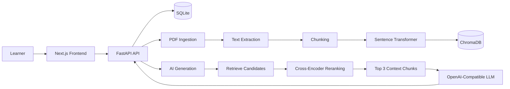

# Study Planner

**An AI-assisted study workspace that turns your own course material into a structured, retrieval-grounded learning workflow.**

Study Planner combines study planning, personal document retrieval, and active-recall tools in a single application. Instead of relying on a generic chatbot, it grounds AI-generated explanations, quizzes, and flashcards in material you have uploaded.

> **Scope:** Local, single-user application. AI features currently use an OpenAI-compatible endpoint, configured by default for LM Studio running on the host machine.

---

## Features

### Study planning

- Create and organize topics and subtopics
- Assign priorities to topics
- Generate date-bounded study schedules
- Set daily study-time budgets
- Track study, review, and quiz sessions
- Mark scheduled sessions as completed

### Study material

- Upload multiple PDFs or folders of PDFs
- Extract and chunk document text
- Detect duplicate documents using SHA-256 hashes
- Index course material for semantic retrieval
- Keep uploaded material persistent across Docker restarts

### Retrieval & AI

- Semantic search using **Sentence Transformers**
- Persistent vector storage with **ChromaDB**
- Cross-encoder reranking of retrieved content
- Retrieval-grounded explanations
- AI-generated multiple-choice quizzes
- AI-generated flashcards
- Schedule generation using the configured LLM

---

## How it works



### Retrieval and generation pipeline

1. A PDF is saved and identified using a SHA-256 content hash.
2. Text is extracted using `pypdf`.
3. The text is split into overlapping chunks.
4. `all-MiniLM-L6-v2` generates an embedding for each chunk.
5. Chunks and metadata are stored in the `Study_materials` ChromaDB collection.
6. A question or generation request retrieves up to 20 candidate chunks.
7. `cross-encoder/ms-marco-MiniLM-L-6-v2` reranks the candidates.
8. The top three chunks are supplied as context to the configured LLM.

The same retrieval pipeline supports study-material explanations, quiz generation, and flashcard generation. The LLM is instructed to use the retrieved context rather than treating requests as unrestricted general chat.

---

## Architecture

The application is split into a **Next.js frontend** and **FastAPI backend**, with persistent application data managed through Docker volumes.

```text
                         Study Planner
                              │
                ┌─────────────┴─────────────┐
                │                           │
          Next.js Frontend            FastAPI Backend
                │                           │
                │                  ┌────────┼────────┐
                │                  │        │        │
                │               SQLite   ChromaDB   LLM
                │                           │
                │                       Retrieval
                │                           │
                └────────────────────── API ┘

                         Docker Compose
                              │
                    ┌─────────┴─────────┐
                    │                   │
              backend-data         model-cache
                    │                   │
              DB / uploads /       Hugging Face /
                ChromaDB          Sentence Transformers
```

---

## Tech Stack

| Layer | Technologies |
|---|---|
| **Frontend** | Next.js 16, React 19, TypeScript, Tailwind CSS, Axios, React Markdown |
| **Backend** | FastAPI, Uvicorn, Pydantic, SQLAlchemy |
| **AI / ML** | Sentence Transformers, `all-MiniLM-L6-v2`, `cross-encoder/ms-marco-MiniLM-L-6-v2`, LangChain text splitters |
| **Storage** | SQLite, ChromaDB, local filesystem |
| **Infrastructure** | Docker, Docker Compose, persistent named volumes |

---

## Quick Start

### Prerequisites

- Docker Desktop with Docker Compose
- [LM Studio](https://lmstudio.ai/) or another OpenAI-compatible LLM server
- A chat model loaded and served by the LLM server

### Start the application

```bash
git clone <repository-url>
cd study_planner

docker compose up --build
```

Open the application:

**http://localhost:3000**

The FastAPI backend is available at:

**http://localhost:8000**

Interactive API documentation:

**http://localhost:8000/docs**

### Enable AI features

The default Docker configuration connects the backend to an OpenAI-compatible server running on the host:

```text
http://host.docker.internal:1234/v1/chat/completions
```

Start the local server in LM Studio and make sure the selected model is being served before using Chat, Quiz, Flashcards, or Schedule generation.

> The first backend build/start may take longer while the embedding and reranking models are downloaded and cached.

---

## Configuration

The current Docker setup uses the following environment variables:

| Variable | Purpose | Default |
|---|---|---|
| `DATA_PATH` | Root directory for SQLite, uploads, and ChromaDB | `/app/data` |
| `HF_HOME` | Hugging Face / Sentence Transformers cache | `/app/model-cache` |
| `LLM_BASE_URL` | OpenAI-compatible chat-completions endpoint | `http://host.docker.internal:1234/v1/chat/completions` |
| `NEXT_PUBLIC_API_URL` | Backend URL used by the browser | `http://localhost:8000` |
| `FRONTEND_ORIGIN` | CORS origin allowed by FastAPI | `http://localhost:3000` |

The checked-in Compose file currently provides the local defaults directly; there is no `.env.example` file yet.

---

## Data Persistence

Docker Compose uses named volumes so application data survives container recreation.

| Volume | Stores |
|---|---|
| `backend-data` | SQLite database, ChromaDB data, and uploaded PDFs |
| `model-cache` | Hugging Face and Sentence Transformers models |

Inside the backend container:

```text
/app/data
/app/model-cache
```

This keeps both application data and downloaded models available when containers are recreated.

---

## Development

### Backend

```bash
cd backend

pip install -r requirements.txt
uvicorn main:app --reload --port 8000
```

### Frontend

```bash
cd frontend

npm install
npm run dev
```

The frontend reads `NEXT_PUBLIC_API_URL` and falls back to:

```text
http://localhost:8000
```

Available frontend scripts:

```bash
npm run build
npm run start
npm run lint
```

---

## Project Structure

```text
study_planner/
├── backend/
│   ├── main.py                 # FastAPI routes and request models
│   ├── ai.py                   # LLM prompts and generated study outputs
│   ├── config.py               # Paths and environment configuration
│   ├── database.py             # SQLAlchemy models and SQLite setup
│   ├── requirements.txt
│   └── scripts/
│       ├── ingestion.py        # PDF extraction, chunking, embedding, indexing
│       └── retrieval.py        # ChromaDB retrieval and reranking
│
├── frontend/
│   ├── src/app/                # Dashboard and study-tool pages
│   ├── src/components/         # Shared UI components
│   ├── src/lib/api.ts          # Axios API client
│   ├── package.json
│   └── Dockerfile
│
├── data/                       # Local development data
├── docker-compose.yml
└── backend/Dockerfile
```

---

## API

| Functionality | Routes |
|---|---|
| **Health** | `GET /health` |
| **Topics** | `GET /topics`, `POST /topics` |
| **Subtopics** | `GET /subtopics/{topic_id}`, `POST /subtopics`, `DELETE /subtopics/{subtopic_id}` |
| **Material** | `POST /upload`, `POST /uploadFolder` |
| **AI study tools** | `POST /ask`, `POST /quiz`, `POST /flashcards` |
| **Schedule** | `POST /schedule`, `GET /schedule`, `PATCH /schedule/{item_id}/complete` |

---

## Future Work

The following are not currently implemented:

- Automated tests for ingestion, retrieval, API routes, and generated-output parsing
- Authentication and user-specific data isolation
- Persistent chat sessions, quiz attempts, and generated flashcard sets
- Explicit prerequisite relationships between topics
- Learning-gap analysis based on quiz results and study history
- Stronger file-upload validation and production deployment controls

---

## Screenshots

Screenshots are not currently included in the repository.

The most useful additions would be:

1. **Dashboard** — prioritized topics and upcoming study sessions
2. **Upload** — indexed course material
3. **Chat** — retrieval-grounded answer with source context
4. **Quiz** — generated questions and feedback
5. **Schedule / Flashcards** — the active-learning workflow

---

<p align="center">
  Built as an AI/ML engineering project around personal study material, retrieval, and active recall.
</p>